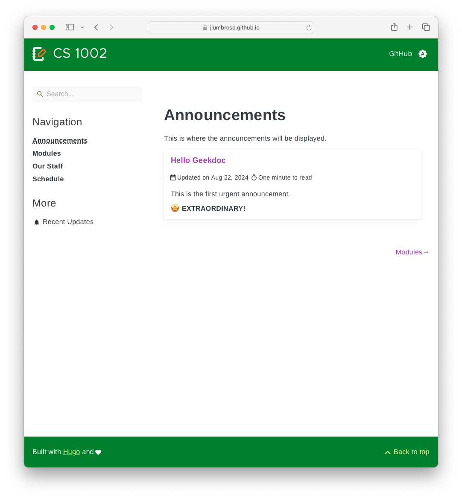
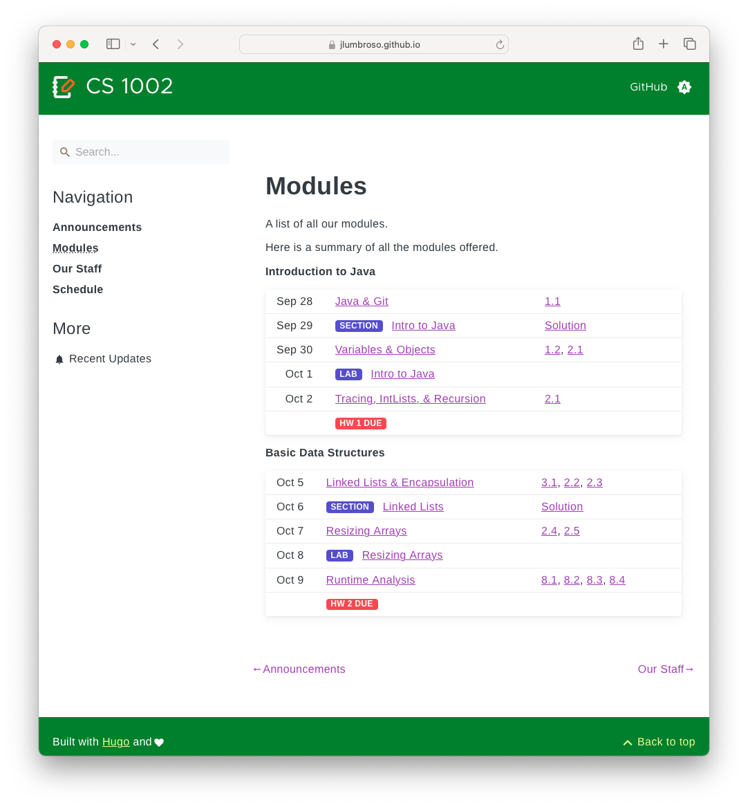
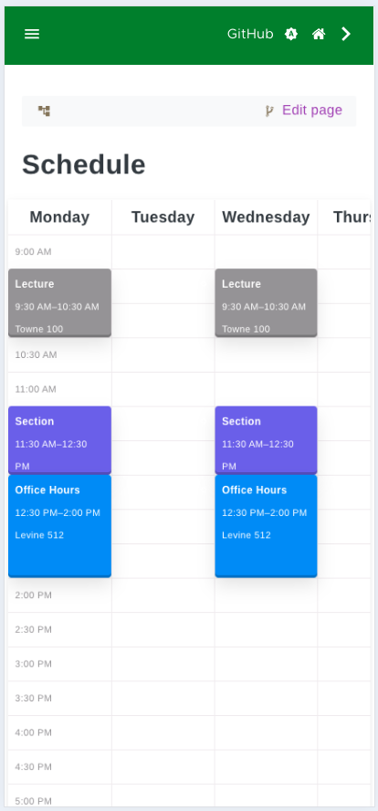

# "Geekdocs Class" Course Website Template

This repository is a self-contained template to create a course website:
- using Hugo static site generator,
- hosted on GitHub,
- deployed to GitHub Pages hosting,
- using the continuous integration available through GitHub Actions,
- with (optionally) a custom domain name.

It builds on the [Geekdocs theme](https://geekdocs.de/) for Hugo, and is inspired by Kevin Lin's Just-the-Class Jekyll template based on the [Just-the-Docs theme](https://pmarsceill.github.io/just-the-docs/) for Jekyll. This template uses files from both of these projects under their respective MIT licenses.

It is designed to work well both on desktop and mobile — and to make it easy to create a course website with a schedule, announcements, staff listings, and modules. It is also designed to be easy to customize and extend.

## Screenshots







## Offline Site Generation

By default, the site is built and deployed by GitHub Actions.  
If you’d like to hand someone a ZIP file or open the site from a USB stick,
run this one-liner:

```bash
env HUGO_RELATIVEURLS=true \
    HUGO_CANONIFYURLS=false \
    HUGO_UGLYURLS=true \
    hugo -b "/" --cleanDestinationDir -d ./offline-website
```

### Why this works

| Setting | What it does |
|---------|--------------|
| **`-b "/"`** | Generates **root-relative** URLs (`/exam/problem01/stories.html`). |
| **`HUGO_RELATIVEURLS=true`** | Rewrites those root-relative URLs so they become truly relative to the current page, inserting the correct number of `../` hops (`stories.html`, `../../about.html`, …). |
| **`HUGO_CANONIFYURLS=false`** | Stops Hugo from “helpfully” turning those relative links back into absolute ones. |
| **`HUGO_UGLYURLS=true`** | Writes every page as a single&nbsp;`.html` file (`/exam/problem01/problem.html`) instead of `/exam/problem01/index.html`, so double-clicking works without a web server. |
| **`--cleanDestinationDir`** | Empties `offline-website/` before each build so no stale files linger. |
| **`-d ./offline-website`** | Sends the finished, self-contained site to that folder; you can zip it or open `index.html` directly. |

The result is a bundle you can drop on a USB stick or email: every link, image,
CSS file, and script resolves correctly when opened at  
`file:///…/offline-website/index.html`, even several levels deep in the
directory tree.

_Thanks to **o3 (ChatGPT, OpenAI)** for the troubleshooting and explanation!_